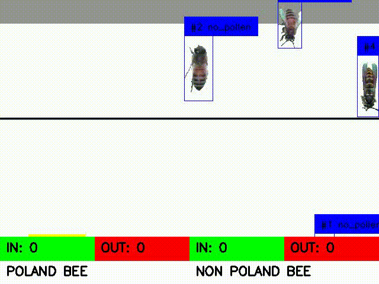

# BEE COUNTING PROJECT

**ONGOING**

This project aims to automate the task at the **University of Peradeniya Faculty of Applied Health Sciences**, which involves **counting bees within a specific time interval**. Previously, human observers would spend time monitoring bee activity and manually count them.
Now, we are using computer vision algorithms to automate this task. The system will be equipped with image processing and object detection techniques to monitor bee activity continuously. 

In the initial stage of this project, a video-capturing setup was not available. To address this limitation, videos with different bee configurations were created using Python scripts. The **TensorFlow bee_dataset** was used to obtain the bee images. Background removal techniques were applied to these images, and they were used to generate videos by placing bee images. The bounding box annotations for the object detection algorithm also generate automatically.

The **YOLOv8** object detection model was chosen and trained for identifying **Poland** and **non-Poland bees**. 
For efficient object tracking, the **Byte-Track** algorithm was used due to its excellent speed and accuracy.

This project is currently ongoing, and the team is continuously working to improve the bee counting system for greater efficiency and accuracy.

