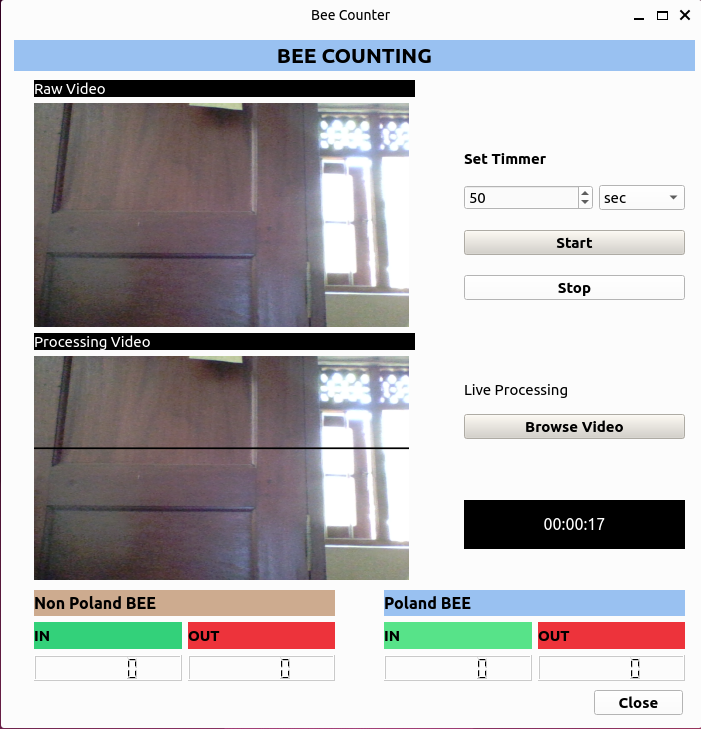
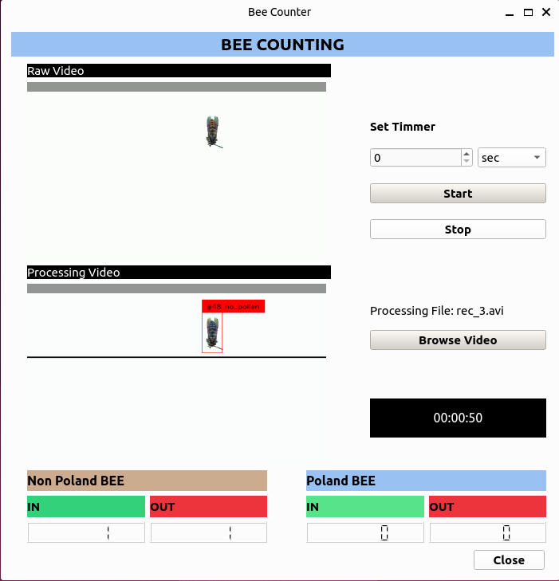
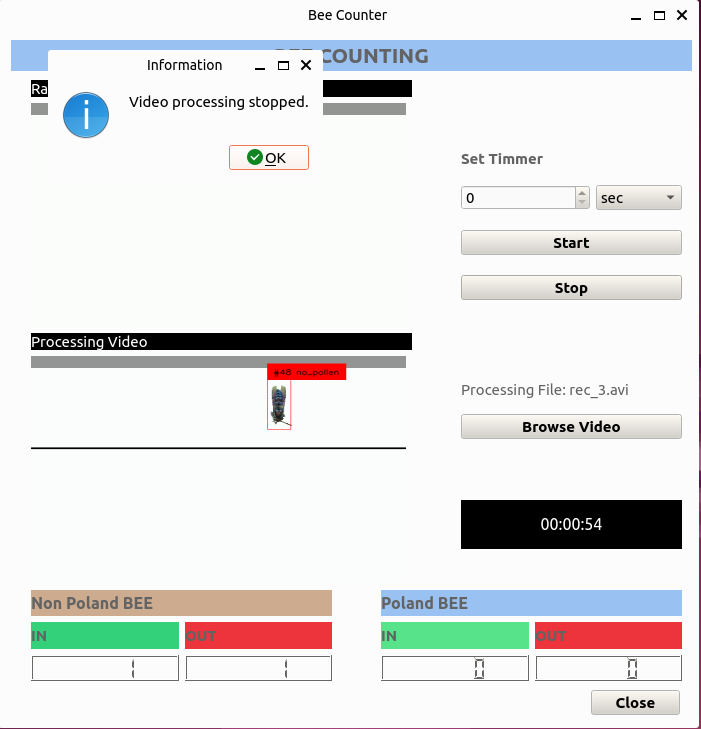

# BEE COUNTING PROJECT

**ONGOING**

This project aims to automate the task at the **University of Peradeniya Faculty of Applied Health Sciences**, which involves **counting bees within a specific time interval**. Previously, human observers would spend time monitoring bee activity and manually count them.
Now, we are using computer vision algorithms to automate this task. The system will be equipped with image processing and object detection techniques to monitor bee activity continuously. 

In the initial stage of this project, a video-capturing setup was not available. To address this limitation, videos with different bee configurations were created using Python scripts. The **TensorFlow bee_dataset** was used to obtain the bee images. Background removal techniques were applied to these images, and they were used to generate videos by placing bee images. The bounding box annotations for the object detection algorithm also generate automatically.

The **YOLOv8** object detection model was chosen and trained for identifying **Poland** and **non-Poland bees**. 
For efficient object tracking, the **Byte-Track** algorithm was used due to its excellent speed and accuracy.

## GUI

| Realtime Camera | Processing | Process Stoped |
|---------|---------|---------|
|  |  | 

The GUI is designed using the **PySide6** Python library.

**GUI App Features**

- The user can monitor bee statistics in real-time, and they can set a time limit in seconds, minutes, or hours.  
  Once the time limit is reached, the process stops. Additionally, users can halt the process in the middle of      capturing.

- Users also have the ability to upload recorded videos. The app will then provide bee statistics from the          uploaded video.

